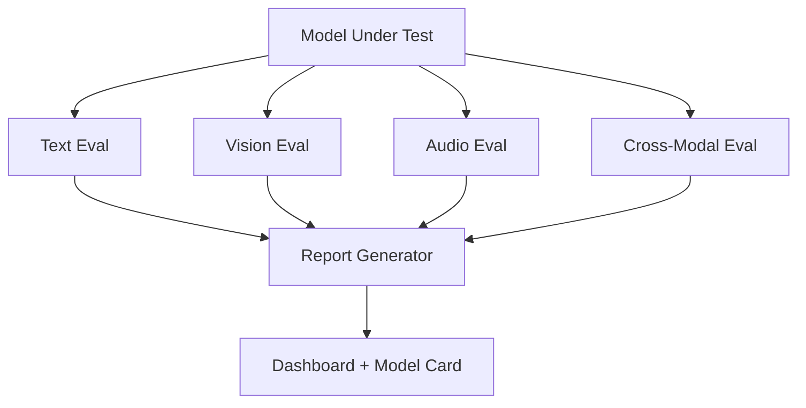

# 📐 Multimodal Evaluation Suite

> Comprehensive evaluation framework for multimodal models: text, vision, audio, and cross-modal benchmarks with automated reporting.

## 🧮 Mathematical Foundation

### Unified Multimodal Score
$$\text{UMS} = \sum_{m \in \{\text{text, vision, audio, cross}\}} w_m \cdot \text{Score}_m$$

### Vision: CLIPScore
$$\text{CLIPScore}(I, T) = \max(0, \cos(\mathbf{e}_I, \mathbf{e}_T)) \times 2.5$$

### Audio: Word Error Rate
$$\text{WER} = \frac{S + D + I}{N}$$

where $S$ = substitutions, $D$ = deletions, $I$ = insertions, $N$ = reference word count.

### Cross-Modal Retrieval
$$\text{R@K} = \frac{|\{q : \text{rank}(q, d^+) \leq K\}|}{|\mathcal{Q}|}$$

### Calibration: Brier Score
$$\text{BS} = \frac{1}{N}\sum_{i=1}^{N}(f_i - o_i)^2$$

### Efficiency Metrics
$$\text{Throughput} = \frac{\text{samples}}{\text{time}}, \quad \text{FLOPS/sample} = \frac{\text{Total FLOPS}}{\text{samples}}$$

## 📊 Benchmark Suite

| Benchmark | Modality | N | Metric |
|---|---|---|---|
| tinyBenchmarks | Text | 1K | Accuracy |
| DocVQA | Vision + Text | 5K | ANLS |
| LibriSpeech | Audio | 2.6K | WER |
| Flickr30K | Cross-modal | 31K | R@1, R@5 |
| SEED-Bench | Multimodal | 19K | Accuracy |
| Custom domain | All | 500 | UMS |

### Model Comparison Template

| Model | Text (%) | Vision (%) | Audio (WER↓) | Cross (R@5) | UMS |
|---|---|---|---|---|---|
| LFM2.5-1.2B | 72 | 0 | N/A | N/A | 0.72 |
| LFM2.5 + VLM SFT | 71 | 68 | N/A | 45 | 0.78 |
| Full multimodal | 70 | 65 | 8.2 | 52 | **0.82** |

## License
MIT
